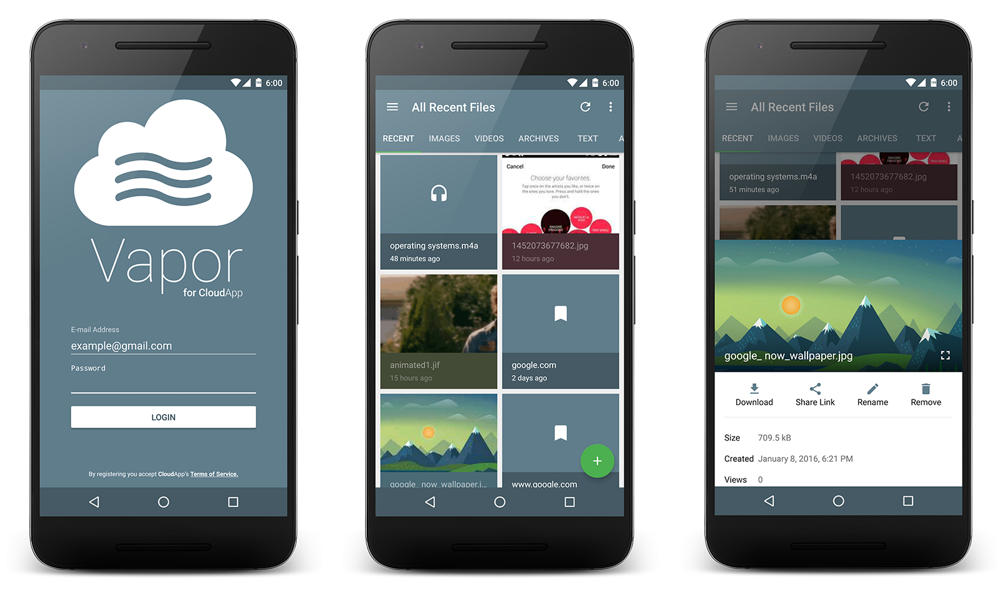

# Vapor for CloudApp
An unofficial Android client for [CloudApp](https://www.getcloudapp.com/). It utilizes the [public API](http://developer.getcloudapp.com/) to extend their platform to modern android phones. 

Vapor follows a Model-View-Presenter (MVP) architectural pattern and borrows some elements from the [Mosby](http://hannesdorfmann.com/mosby/) library.

<p align="center">
    
</p>

## Requirements

- [Android SDK](http://developer.android.com/sdk/index.html).
- Android [7.1 (API 25) ](http://developer.android.com/tools/revisions/platforms.html).
- Android SDK Tools (Gradle 2.2+)
- Android SDK Build tools 25
- Android Support Repository
- MinSdkVersion 16

## Libraries

The libraries and tools used include:

- Support library
- RecyclerView and Palette
- [RxJava](https://github.com/ReactiveX/RxJava) and [RxAndroid](https://github.com/ReactiveX/RxAndroid) 
- [Retrofit 2.0](http://square.github.io/retrofit/) and [OkHttp](https://github.com/square/okhttp)
- [Dagger 2](http://google.github.io/dagger/)
- [Butterknife](https://github.com/JakeWharton/butterknife)
- [Timber](https://github.com/JakeWharton/timber)
- [Otto](http://square.github.io/otto/) 
- [Glide](https://github.com/bumptech/glide)
- [Once](https://github.com/jonfinerty/Once)
- [IcePick](https://github.com/frankiesardo/icepick)
- [Sugar](https://github.com/satyan/sugar)
- [BottomSheet](https://github.com/Flipboard/bottomsheet)
- [Material Dialogs](https://github.com/afollestad/material-dialogs)
- [Joda Time Android](https://github.com/dlew/joda-time-android)

#### Kotlin? [Click here](https://github.com/tevjef/Vapor/tree/kotlin)

# Licence

```
Copyright 2015 Tevin Jeffrey.

Licensed under the Apache License, Version 2.0 (the "License");
you may not use this file except in compliance with the License.
You may obtain a copy of the License at

    http://www.apache.org/licenses/LICENSE-2.0

Unless required by applicable law or agreed to in writing, software
distributed under the License is distributed on an "AS IS" BASIS,
WITHOUT WARRANTIES OR CONDITIONS OF ANY KIND, either express or implied.
See the License for the specific language governing permissions and
limitations under the License.
```
